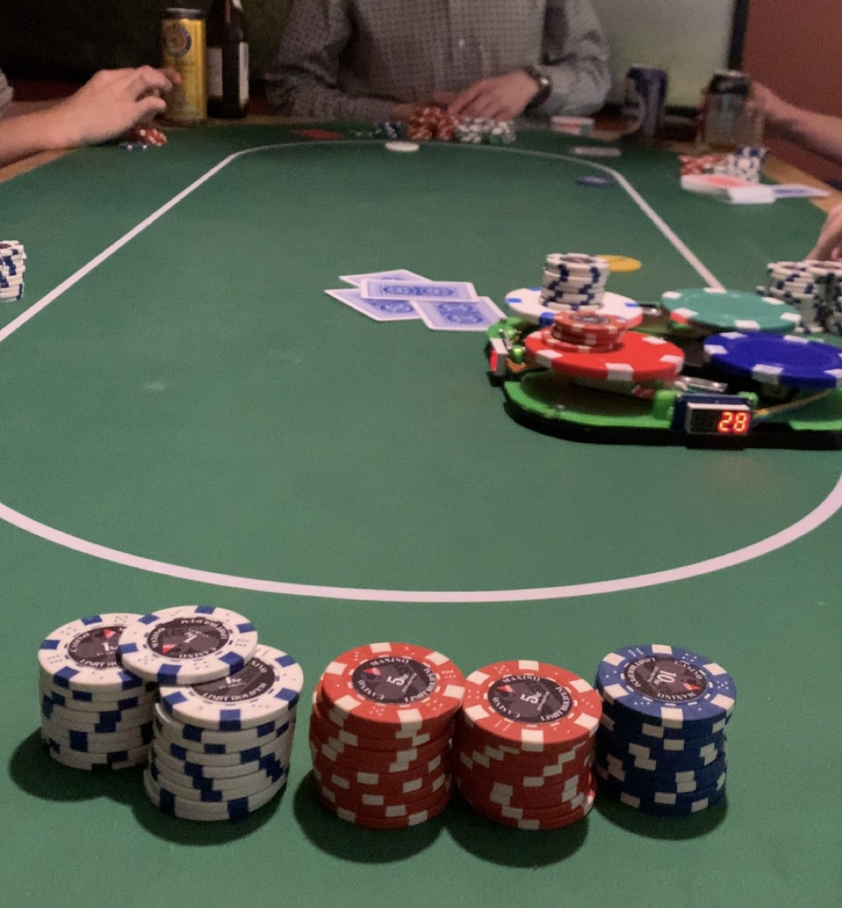

# Arduino-Based Poker Scale

## Overview
This Arduino-based poker scale is a custom-built system designed to simplify the process of summing poker chip values during games. The scale combines precision electronics and customizable software to deliver a highly functional and user-friendly experience. Built on an Arduino platform, it integrates 3D-printed chassis components, load cell technology, and intuitive controls to create a reliable and efficient tool for poker enthusiasts.

## Key Features
- **4-Digit 7-Segment Displays**: Four vibrant, easy-to-read 7-segment displays provide a clear and concise output of the calculated chip sum.
- **Load Cells and HX711**: Utilizes four 1kg load cells connected to an HX711 amplifier for accurate weight measurement.
- **Customizable Chip Values**: A user-friendly menu allows players to adjust the monetary value assigned to each chip color.
- **Calibration Options**: Recalibrate chip weights to ensure long-term accuracy.
- **Preset Chip Types**: Save and load default weight profiles for different types of poker chips, making setup quick and consistent.
- **Dual Button Interface**: Includes a **Tare** button for resetting the scale and a **Menu** button for accessing settings.
- **3D-Printed Chassis**: A durable and custom-designed chassis houses all components, ensuring portability and style.

## Components
1. **Arduino Microcontroller**: The brain of the system.
2. **4 x 4-Digit 7-Segment Displays**: Displays the calculated chip sum.
3. **HX711 Amplifier**: Interfaces with the load cells to provide precise measurements.
4. **4 x 1kg Load Cells**: Ensures accurate weight detection for poker chips.
5. **3D-Printed Chassis**: Custom design to fit the scale's hardware components.
6. **2 x Buttons**: Tactile buttons for Tare and Menu functionality.

## Functionality
### Tare Function
The Tare button resets the scale, ensuring precise measurements even if residual weight remains on the platform.

### Menu Options
The Menu button provides access to:
- **Chip Value Adjustment**: Modify the assigned value of each chip color.
- **Weight Recalibration**: Update the weight measurements for accurate readings.
- **Default Profiles**: Save and switch between different preset chip types.

## Assembly and Setup
1. **3D-Printed Chassis**: Print the chassis parts using the provided 3D model files.
2. **Load Cell Installation**: Secure the four 1kg load cells to the chassis.
3. **Electronics Integration**: Connect the load cells to the HX711 and then to the Arduino.
4. **Display Connection**: Wire the 7-segment displays to the Arduino.
5. **Button Placement**: Attach the Tare and Menu buttons to the chassis.
6. **Power Up**: Load the Arduino code and power the device.

## Acknowledgments
A huge shout-out to **Max Idermark** for his invaluable support with the initial design and his enthusiasm during the development of this project. Max's expertise and passion for poker made this project even more enjoyable to work on—and always a pleasure to play against.

## Images in game

## Conclusion
This poker scale is a perfect example of combining engineering and creativity to enhance a classic game. Its customizable features and precision make it a valuable tool for any poker enthusiast. Whether you're a casual player or a serious competitor, this scale ensures a seamless gaming experience.

---
Feel free to reach out for any questions or further details about the project!
